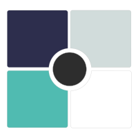

# Bloc-Them
A Business Logic Component implementation for front end Javascript web components.\


If you have not heard what is Bloc, then check out the [theory](#theory).\
If you are familiar with Bloc, then read descriptions of the components this library offers to use Bloc Pattern for your front end development.

# What it can do ?
1. **[use-them](https://www.npmjs.com/package/use-them)** ready to use webcomponent for creating PWA mobile apps.
2. **[lay-them](https://www.npmjs.com/package/lay-them)** to layout your other webcomponents in column, row and stack.
3. **[route-them](https://www.npmjs.com/package/route-them)** to create routes in your single page application.

## Pre-requisite for usage
1. Basic understanding of ES6 classes and inheritance.
3. Basic knowledge of [lit-html](https://lit-html.polymer-project.org/).

## Important Classes and uses

### **Bloc<S\>**: where S is state of your app you are trying to control
Bloc class where in you will implement the non gui business logic.
For ex:
```ts

export class CounterBloc extends Bloc<number>{
  //this name will be used to search for bloc in the node tree
  _name="CounterBloc";

  constructor(){
      super(0); //passing in initial state as 0;
  }

  //emit is used to give new states of your app.

//increment increases the sate your app by 1 and then emits the new state, so that all other GUI components, which depends on this count can re-render themselves to this new state.
  increment(){
      let n = this.state;
      n++;
      this.emit(n);
  }

//decrement decreases the state and then emit this new state.
  decrement(){
      let n = this.state;
      n--;
      this.emit(n);
  }
}
```
The above bloc tries to manage count state of your app.

You can create various such bloc to control other aspects of overall state of your app.
And then create methods on this blocs to, which will modify state and then call emit to publish this new state.

### **BlocsProvider**
This class is a **[webcomponent](https://developer.mozilla.org/en-US/docs/Web/Web_Components)**, which aims to provide blocs to other components of your app.
**One BlocsProvider can provide multiple types of blocs** to all its children in the DOM tree.
And hence bloc is plural in BlocsProvider, as its job is to provide blocs to webcomponents below this.

```ts

export class CounterBlocProvider extends BlocsProvider{
  constructor(){
      super({
        CounterBloc:new CounterBloc()
      });
  }

  builder(){
      return html`<div><slot></slot></div>`;
  }
}

//defining the web component
customElements.define("counter-bloc-provider", CounterBlocProvider);
```


### **BlocBuilder<B extends Bloc<S\>, S\>**: where S is state and B is Bloc implementation
This class do the actual building of a **[webcomponent](https://developer.mozilla.org/en-US/docs/Web/Web_Components)**. It has a builder method which can be used to return TemplateResult objects returned by [lit-html](https://lit-html.polymer-project.org/).
```ts

export class CounterBlocBuilder extends BlocBuilder{

constructor(){
    super("CounterBloc");//name of the bloc we require for this builder
}

increment=()=>{
  this.bloc.increment();
}

decrement=()=>{
  this.bloc.decrement();
}

builder(state){
    let color = this.useAttribute["color"];
    return html`
    <div style="color: ${color}">Current state is : ${state}</div>
    <div><button @click=${this.increment}>increment</button></div>
    <div><button @click=${this.decrement}>decrement</button></div>
    `;
}
}

//defining the web component
customElements.define("counter-bloc-builder", CounterBlocBuilder);
```
BlocBuilder constructor also can be provided with a BlocBuilderConfig, which has a parameter **useThisBloc**.
which can be used to provide a bloc directly, without for the need for BlocsProvider to provide it.


Now after defining bloc, blocs provider and bloc builder you can use, this as like this in HTML.
```
//lit-html tag
html`
  <counter-bloc-provider>
    <div>
      <h1>Blocs demo</h1>
      <counter-bloc-builder use="color: red;"></counter-bloc-builder>
    </div>
  </counter-bloc-provider>
      `
```

In this `counter-bloc-provider` provided the bloc, and `counter-bloc-builder` has encapsulated the GUI buttons, which will use logics provided by the CounterBloc.
This may seem pretty simple and basic, but it can be used to create very complex applications.

**use-them** is set of webcomponents created on top of bloc-them library. They are ready to use webcomponents for creating mobile apps.


## Installation
```bash
npm i bloc-them
```

## Usage
For a detail usage see the demo directory in the git.


## Tooling configs

For most of the tools, the configuration is in the `package.json` to reduce the amount of files in your project.

If you customize the configuration a lot, you can consider moving them to individual files.

## Local Demo with `web-dev-server`
```bash
npm start
```
To run a local development server that serves the basic demo located in `demo/index.html`


## Change logs
### "version": "5.0.3"
1. Added GUI maker
2. BlocBuilder now has a BlocsMap , so extra blocs can be provided by it too.
3. BlocsProvider has a default constructor value for the blocs map.

### "version": "5.0.2"
1. Updated readme . 
2. Added Logo.

### "version": "5.0.1"
1. Added rollup support. Now the bloc-them lib can be used as a separate JS file too. YOu need to provide external `lit-html` in that case.

### "version": "5.0.0"
1. Instead of passing array in BlocsProvider and ReposProvider, we now supply blocsMap and repoMaps , basically javascript object. Keys for this maps are name of the Bloc/Repo and value will be the instance of Blocs. The benefit of this is faster Bloc search.
2. Blocs now has hostElement attribute, which can be a BlocsProvider or BlocBuilder. This value is set in connection call and hence is not available during constructor phase. This was added as previously we need to supply a html element to find the blocs, now using this we have automated blocs and repos detection.
3. getRepo and getBloc methods have been added to bloc to find and search for blocs.
4. Bloc constructor has now an optional argument BlocDependencies , via which we can mention Blocs and Repos this bloc wil need to function and those repo and blocs will be made available to the bloc. (and can be get with getRepo and getBloc respectively)
```ts
interface BlocDependencies{
  blocs?:string[];
  repos?:string[];
}
```

### "version": "4.0.0"
1. Have to change bloc searching and naming, as typescript/bundling tools were renaming classes to different names and as such blocs were not visible in all cases.
Now when you extends a bloc you need to provide a protected property _name . This same name is used to search for the bloc in the dom tree.

### "version": "3.0.4"
1. Added more debugging features to bloc builder.

### "version": "3.0.3"
1. Now in widget builder config we can pass custom search criteria to select blocs. This custom 

### "version": "3.0.2"
1. Changed the generic structure for blocs, to make them more generic.

### "version": "3.0.0"
1. Version 2.0.0 is failed concept and often causes infinite loop. Discarding the changes back.

### "version": "2.0.0" : FAILED, DO NOT USE IT
1. Added a prebuid step, to perform async business logic before final render. While this final render is dne, a prerender can be displayed, to show loading.

### "version": "1.0.0"
1. Changed the generic structure for blocs, to make them more generic.

### "version": "0.0.5"
1. Enhancement : As of now Blocs could only create no argument constructor, now blocs can create Argument based constructor.

### "version": "0.0.4"
1. Bug fix: parentElement is returned null often when nesting custom elements. This fixes that issue and uses parent node and host property to get to the actual parent node.

### "version": "0.0.3"
1. Bug fix: use attribute was putting debug logs to console.
3. Bug fix: use attributes value must be trimmed before use.

### "version": "0.0.3"
1. **use** attribute now on BlocsProvider, BlocBuilder and ReposProvider.\
In html:
```html
 <counter-bloc-builder use="color: red;"></counter-bloc-builder>
```
In JS code:
```js
builder(state){
    let color = this.useAttribute["color"];
    return html`
    <div style="color: ${color}">Current state is : ${state}</div>
    <div><button @click=${this.increment}>increment</button></div>
    <div><button @click=${this.decrement}>decrement</button></div>
    `;
}
```


## Theory

### What is Business Logic ?
Lets explain it with examples: 

1. Say you are designing an Arithmetic calculator App. 
Then all logics(**non gui codes** which perform the actual intent of your app) that you will write specifically for your calculator, say **calculate_square_root**, or any other non-gui function(one which do not render's GUI to screen), is termed as Business Logic.
3. Say you are writing a Social media app.
then all logics(**non gui codes** which perform the actual intent of your app) that you will write specifically for your social media pp, say **fetch_user_profile**, **add_new_user_to_indexedb**,or any other non-gui function(one which do not render's GUI to screen), is termed as Business Logic.

Business logic is the basic functionality of your app, which you ae trying to offer to client apart frm pretty GUI.

### The core aim of business logic ?
The core aim of a business logic is to modulate/maintain/control a state of your application. 
For example,all non gui code for user sign up form, is trying to maintain an object which has all form information user has entered in the form or required to submit the sign up form.

So **the core aim business logic is to modulate state of your app.**
Whenever it modulates this state, the front end GUI, which depends on this state muts re-render to give the latest update to user.


For example user types in something in the search box for an app.
The Search box will try to validate it.
Then tries to make a request to resource, which will give the result and once received response from the sources system, may need to modify it to display appropriately on front end GUI.

### Whats the problem with existing JS system ?
If you are using vanilla JS to design a big sized app, then there is 99.99% probability, that the one who will maintain your apps for bugs,  will pull their hairs to keep track of places where in you as a developer have written the business logic, which controls state of the application. 

Without a framework, the business logic is spread every where, which experience says is very difficult to track, which ultimate will make a challenge to determine, why the current state of your app is something out of expectation, and further which portion of your code is responsible for that modification.

## How Bloc pattern solves the above problem ?
Bloc : Business Logic Components.
Bloc is framework to keep all your business logic at one place, meanwhile making a predictable state change, so you can track exactly which portion of code has made the change in the state.

A single bloc maintains a single type of state.\
For example:
1. For a counter portion of your app, CounterBloc will only manage current count (state) of the app.
3. For list of options, will maintain current selection and all options as state.

And your GUI uses this state to render out put data. So if the data is incorrect, you exactly know that the Bloc which manages this portion of state of your app, is responsible for this inconsistent behavior.


## Build instruction
1. Roll up `npx rollup -c rollup.config.js`
2. Directly import it into project
